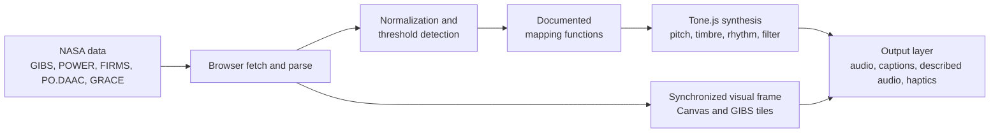

<a id="top"></a>

<div align="center">

# Earth Jukebox

### A browser-based sonification instrument that turns NASA Earth observations into live, explainable sound


[Live Demo](https://YOUR-DEMO-LINK) &nbsp;|&nbsp; [Pitch Video](https://YOUR-VIDEO-LINK) &nbsp;|&nbsp; [Challenge Page](https://www.spaceappschallenge.org/)

</div>

---

<div align="center">

<a href="#abstract">
  
</a>
<a href="#problem-statement">
  
</a>
<a href="#approach-and-design-principles">
  
</a>
<a href="#data-sources">
  
</a>
<a href="#system-architecture">
  
</a>
<a href="#sonification-specification">
  
</a>
<a href="#reference-scenes">
  
</a>
<a href="#case-study-bangladesh-coastline">
  
</a>
<a href="#accessibility">
  
</a>
<a href="#challenge-alignment">
  
</a>
<a href="#technology-stack">
  
</a>
<a href="#getting-started">
  
</a>
<a href="#repository-structure">
  
</a>
<a href="#limitations-and-validation-plan">
  
</a>
<a href="#roadmap">
  
</a>
<a href="#team">
  
</a>
<a href="#license-and-data-attribution">
  
</a>

</div>

---

## Abstract

Earth Jukebox is a client-side web instrument that converts real NASA satellite and reanalysis observations into synthesized audio in real time. Every sound parameter is derived from a documented, deterministic mapping function applied to observed data, and the active mapping is displayed on screen during playback. The system uses 15 NASA datasets across three layers (core, extended, and frontline context), runs entirely in the browser with no server-side audio rendering and no pre-recorded clips, and is designed non-visual-first, with the visual frame acting as a companion to the audio rather than the primary interface.

The project is built in Chittagong, Bangladesh, and uses the country's low-lying coastline as its primary case study for communicating climate risk through sound.

---

## Problem Statement

Nearly all NASA climate products reach the public as visual artifacts: heat maps, line charts, and dashboards. This creates two problems.

**Exclusion.** Over two billion people live with some form of near or distance vision impairment. For them, most climate data is effectively unavailable.

**Weak signal for everyone else.** Slow, long-term trends encoded as small color shifts rarely register with viewers, regardless of ability.

Human hearing is well suited to the opposite task. It detects small changes in pitch, rhythm, and texture over time, which is the structure much climate data has.

| | Visual chart | Earth Jukebox |
|---|---|---|
| Audience | Sighted users only | All users, including blind and low-vision users |
| Slow trend | Subtle color shift, easy to miss | Steadily falling or rising tone |
| Threshold crossing | A single red region | Timbre change to turbulent noise, plus device vibration |
| Interpretability | Reader decodes a legend | Mapping is stated on screen while the sound plays |

Earth Jukebox is intended as a second representation of the same science, not as an add-on to an existing dashboard.

---

## Approach and Design Principles

1. **Accessibility first.** The interface is designed for non-visual use from the outset. The visual frame supports the audio, not the reverse.
2. **Transparent mapping.** Every data-to-sound mapping is fixed, documented, and shown during playback. The instrument is readable, not a black box.
3. **Observed data only.** Every tone traces back to a NASA satellite or reanalysis record. Nothing is simulated or invented.
4. **Shared timeline.** Sighted and non-sighted users scrub the same moment in time, which allows collaborative exploration of one dataset.
5. **Zero-install delivery.** The full experience runs in a modern browser with no build step and no backend audio pipeline.

---

<div>

<a href="#data-sources">
  
</a>

</div>

The system draws on 15 NASA datasets organized into three layers, plus three NASA discovery and verification tools.

### Layer 1: Core datasets (primary audio voices)

| # | Dataset | NASA Source | Role in the Sound |
|:-:|---|---|---|
| 1 | Temperature, rainfall, solar radiation (daily, any coordinate) | [NASA POWER](https://power.larc.nasa.gov/) | Pitch and brightness of the lead melody |
| 2 | Sea ice and global imagery tiles | [NASA GIBS](https://nasa-gibs.github.io/gibs-api-docs/) | Visual frame synchronized to audio; sea ice drives the pitch register |
| 3 | Active fire and thermal anomaly detections | [NASA FIRMS](https://firms.modaps.eosdis.nasa.gov/) | Percussion: one metallic hit per fire event |
| 4 | Sea level and sea surface height | [NASA PO.DAAC](https://podaac.jpl.nasa.gov/), [Sea Level Change Portal](https://sealevel.nasa.gov/) | Synthesized waves; turbulent noise past the flood threshold |
| 5 | Vegetation index (NDVI) | [MODIS / VIIRS](https://modis.gsfc.nasa.gov/) | Slow seasonal background voice |
| 6 | Terrestrial water storage | [GRACE / GRACE-FO](https://grace.jpl.nasa.gov/) | Bass line underpinning the mix |

### Layer 2: Extended datasets (historical depth and context)

| # | Dataset | NASA Source | Role in the Sound |
|:-:|---|---|---|
| 7 | Global surface temperature anomaly (1880 to present) | [NASA GISTEMP](https://data.giss.nasa.gov/gistemp/) | Long-term warming baseline: a slowly rising drone beneath every scene |
| 8 | Sea ice concentration, passive microwave (1978 to present) | [NSIDC DAAC (NSIDC-0051)](https://nsidc.org/data/nsidc-0051) | The 40-year Arctic record behind the bright-tone-to-bass transition |
| 9 | Land surface temperature | [MODIS LST](https://modis.gsfc.nasa.gov/data/dataprod/mod11.php) | Filter brightness: hotter land yields a sharper timbre |
| 10 | Precipitation (monsoon and cyclone rainfall) | [GPM IMERG](https://gpm.nasa.gov/data/imerg) | Granular rain texture: heavier rain, denser grains |
| 11 | Soil moisture | [SMAP](https://smap.jpl.nasa.gov/) | A soft pad that thins as soil dries |
| 12 | Sea surface temperature | [MUR SST at PO.DAAC](https://podaac.jpl.nasa.gov/dataset/MUR-JPL-L4-GLOB-v4.1) | Chorus shimmer: warmer seas, wider shimmer |
| 13 | Atmospheric carbon dioxide | [OCO-2](https://oco.jpl.nasa.gov/) | Harmonic richness: more CO2, more overtones |

### Layer 3: Frontline context (Bangladesh case study)

| # | Dataset | NASA Source | Role |
|:-:|---|---|---|
| 14 | Population density and exposure | [NASA SEDAC (GPW)](https://sedac.ciesin.columbia.edu/) | Quantifies the population inside the flood zone; read out through described audio |
| 15 | Elevation (digital elevation model) | [NASADEM / SRTM](https://lpdaac.usgs.gov/products/nasadem_hgtv001/) | Defines flood-threshold lines for Bangladesh's low-lying coast |

### NASA tools in the pipeline

| Tool | Use |
|---|---|
| [Worldview](https://worldview.earthdata.nasa.gov/) | Verifying imagery and layers against the visual frame |
| [Earthdata Search](https://search.earthdata.nasa.gov/) and [CMR API](https://cmr.earthdata.nasa.gov/search/) | Programmatic discovery and retrieval of granules |
| [Giovanni](https://giovanni.gsfc.nasa.gov/giovanni/) | Time-series cross-checks for cached samples |

> NASA POWER requires no API key and provides decades of daily data for any coordinate. It is the backbone of the fastest working pipeline in this project.


---

## System Architecture

Earth Jukebox executes entirely client-side. Raw pixel values and time series are passed through explicit mapping functions into audio parameters, then rendered live through the Web Audio API using Tone.js.



### Pipeline stages

| Stage | Responsibility |
|---|---|
| Acquisition | Fetch time series and tiles from NASA endpoints; fall back to cached samples in `/data` for offline or rate-limited use |
| Normalization | Scale each variable to a defined range so mappings are comparable across datasets and regions |
| Threshold detection | Flag crossings (for example, sea level against the elevation-derived flood threshold) |
| Mapping | Apply the fixed, documented function from each variable to its audio parameter |
| Synthesis | Render pitch, timbre, rhythm, filter, and noise live with Tone.js |
| Output | Emit audio, synchronized captions, described-audio narration, and haptic events from one shared timeline |


---

## Sonification Specification

The principal risk in sonification is audio that sounds arbitrary. Earth Jukebox addresses this by publishing a fixed mapping for every variable and displaying the active mapping on screen during playback.

| Variable | Audio Parameter | Range |
|---|---|---|
| Temperature anomaly | Pitch | Low (cool) to high (warm) |
| Data variability and noise | Timbre complexity | Pure tone to textured and granular |
| Seasonal cycle | Rhythm | Slow pulse synchronized to the annual cycle |
| Sea ice extent | Pitch register | Bright and high (thick ice) to heavy bass (melted) |
| Wildfire intensity | Percussion density and sharpness | Sparse soft hits to dense metallic crackle |
| Sea level rise | Wave amplitude | Calm tide to turbulent white noise past flood threshold |
| Global warming anomaly (GISTEMP) | Baseline drone | Steady to slowly rising |
| Land surface temperature | Filter brightness | Dark and soft to bright and sharp |
| Rainfall (IMERG) | Granular texture density | Light drizzle to dense downpour |
| Soil moisture (SMAP) | Pad warmth | Full and warm to thin and dry |
| Sea surface temperature | Chorus shimmer | Narrow to wide, warmer shimmer |
| Atmospheric CO2 (OCO-2) | Harmonic richness | Few overtones to crowded and dense |

The mapping specification is intended to be published as an open, reusable sonification schema (see [Roadmap](#roadmap)).


---

## Reference Scenes

### Arctic sea ice, 1980s to present

Thick, healthy ice is rendered as a bright, crystalline tone. As four decades of warming reduce the ice cap, that tone descends into a heavy bass rumble.

```
 Pitch
  high |  ***
       |      ***
       |          ***
   low |              ****   <- bass rumble: ice cover lost
       +------------------------------>
        1980s                    today
```

### Wildfire (NASA FIRMS)

Each detected fire becomes a percussive event. Early or low-activity periods are sparse and soft; high-activity periods become dense, sharp, metallic crackle.

### Rising sea (NASA PO.DAAC)

Sea level drives synthesized waves in proportion to the measured change. Past the flood threshold, a calm tide breaks into turbulent white noise, an acoustic warning that does not depend on vision.


---

## Case Study: Bangladesh Coastline

Bangladesh contributes little to global emissions, yet its low-lying coast is among the first regions to experience sea-level rise. Roughly 40 million people live along that coastline. Earth Jukebox is built in Chittagong, so the global datasets carry a local meaning.

- NASA PO.DAAC sea-level records are mapped one to one to tidal wave sound.
- Flood-threshold lines are derived from NASADEM elevation data (dataset 15).
- Exposure is quantified using SEDAC population data (dataset 14) and read out through described audio.
- When flooding breaches coastal communities, the audio shifts to turbulent white noise, providing an immediate acoustic warning.
- Crossing a danger threshold also triggers haptic vibration on mobile devices, which is useful where connectivity is limited and screens are hard to read.
- Planned: a Bangladesh preset combining coastal sea level with cyclone frequency.


---

## Accessibility

Accessibility is the foundation of the product, not an additional feature. The project targets WCAG AAA conformance; formal conformance testing is listed in the [validation plan](#limitations-and-validation-plan).

| Area | Implementation |
|---|---|
| Standard | Designed to meet WCAG AAA |
| Screen readers | Full support, with a dedicated described-audio mode |
| Keyboard | Complete navigation; no mouse-only interactions |
| Haptics | Mobile vibration at critical danger thresholds |
| Captions | On-screen text synchronized to every spoken and sonified cue |
| Transparency | Active data-to-sound mapping displayed during playback |


---

## Challenge Alignment

| Criterion | Earth Jukebox |
|---|---|
| Problem | NASA climate observations are delivered almost entirely visually, which excludes over two billion people with vision impairment |
| NASA data | 15 datasets (GIBS, POWER, FIRMS, PO.DAAC, MODIS/VIIRS, GRACE, GISTEMP, NSIDC, GPM, SMAP, MUR SST, OCO-2, SEDAC, NASADEM), all real observations, sonified live |
| Frontline story | Bangladesh's coast: sea-level rise rendered as an audible early warning |
| Universal accessibility | WCAG AAA target, screen reader support, keyboard navigation, haptics, captions |
| Team | Team DeltaEcho: six members, Chittagong, Bangladesh |


---

## Technology Stack

| Layer | Technology |
|---|---|
| Frontend | HTML5, CSS3, JavaScript (no framework required for the core experience) |
| Audio | [Tone.js](https://tonejs.github.io/) on the Web Audio API for real-time synthesis |
| Imagery | NASA GIBS WMTS tiles for live satellite imagery |
| Rendering | Canvas API for the synchronized visual frame |


---

## Getting Started

**Requirements:** a modern browser (Chrome, Firefox, Edge, or Safari 14.1+) and any static file server.

```bash
git clone https://github.com/aritradev/DeltaEcho-Jukebox.git
cd earth-jukebox

# No build step. Serve the folder:
npx serve .
# or
python3 -m http.server 8080
```

Open `http://localhost:8080`, press play, and listen.

---

## Repository Structure

```
earth-jukebox/
|-- index.html      # Application shell and layout
|-- style.css       # Visual design (instrument-panel theme)
|-- script.js       # Data handling, canvas rendering, Tone.js engine
|-- /assets         # Icons, fonts, static media
|-- /data           # Cached NASA dataset samples (POWER, FIRMS, PO.DAAC, NDVI)
`-- README.md
```


---

## Limitations and Validation Plan

**Current limitations**

- Live endpoint integration is in progress; some scenes currently run on cached samples in `/data`.
- Sonification involves design choices (scales, ranges, normalization). These are documented, but they are choices, not neutral encodings of the data.
- Several datasets (for example, GRACE and OCO-2) have coarse spatial or temporal resolution, which limits fine-grained local interpretation.
- WCAG AAA is a design target; it has not yet been verified by an external audit.

**Planned validation**

- Usability sessions with blind and low-vision participants, including schools for the blind, to test whether listeners correctly identify trends and threshold events from sound alone.
- Screen reader testing across common platforms and assistive technologies.
- Cross-checking cached samples against Giovanni and Worldview to confirm data fidelity.


---

## Roadmap

- [ ] Wire live NASA GIBS, POWER, FIRMS, and PO.DAAC endpoints into the sonification engine
- [ ] Ship a described-audio narration track for screen-reader mode
- [ ] Add the Bangladesh frontline preset (coastal sea level and cyclone frequency)
- [ ] Pilot Earth Jukebox with schools for the blind
- [ ] Publish the sound-mapping specification as an open, reusable sonification schema

<p align="right"><a href="#top">Back to top</a></p>

---

## Team

**Team DeltaEcho**, six members, Chittagong, Bangladesh.

---


<div align="center">

Built for NASA Space Apps Challenge 2026, Challenge 14: The Earth Information Jukebox.

</div>
